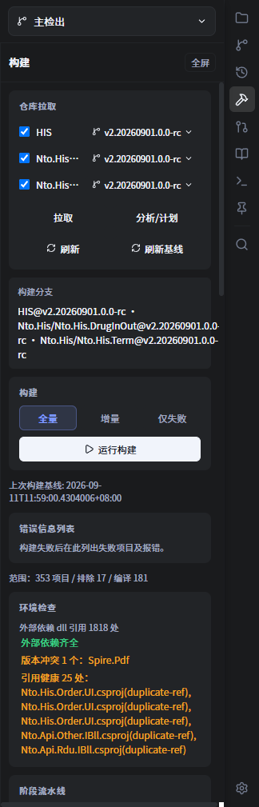
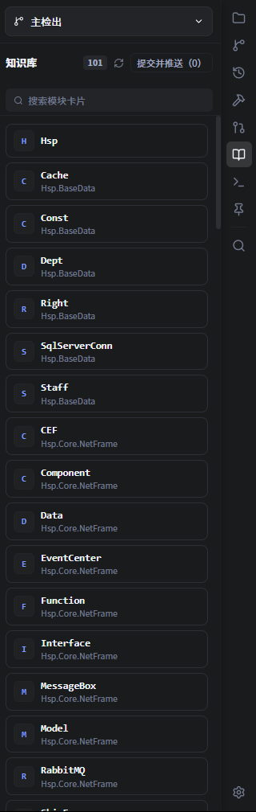
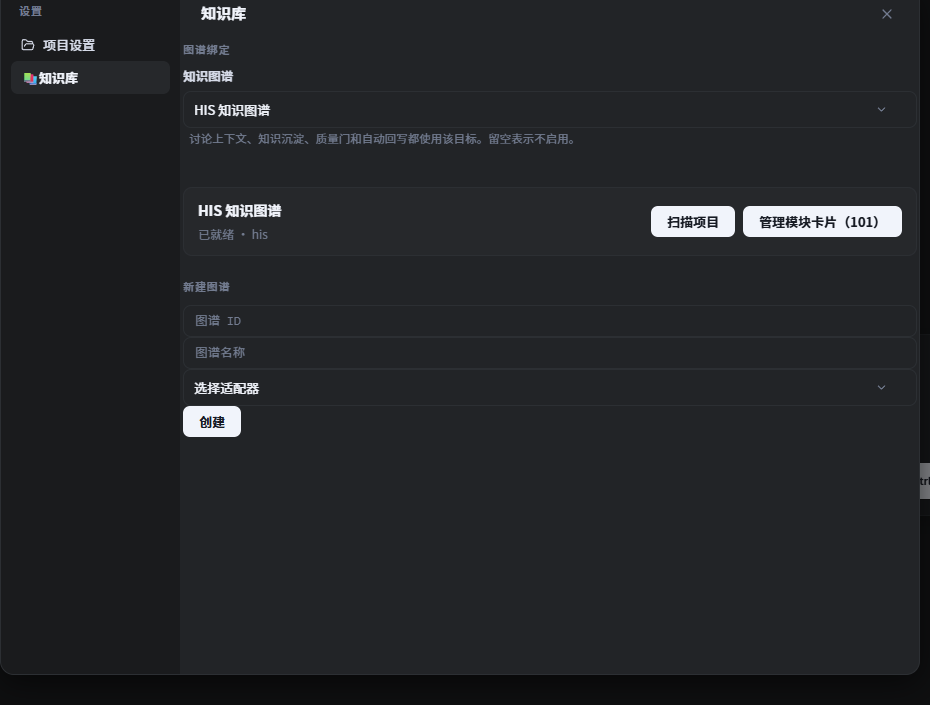
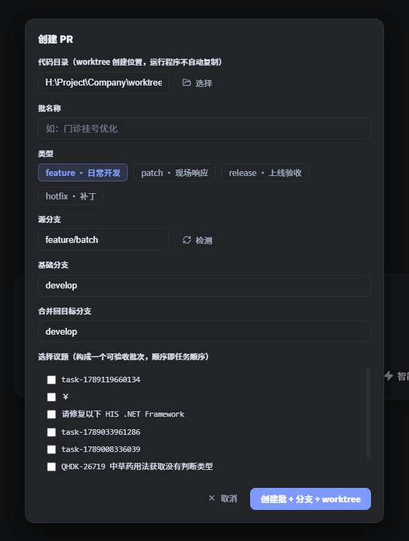
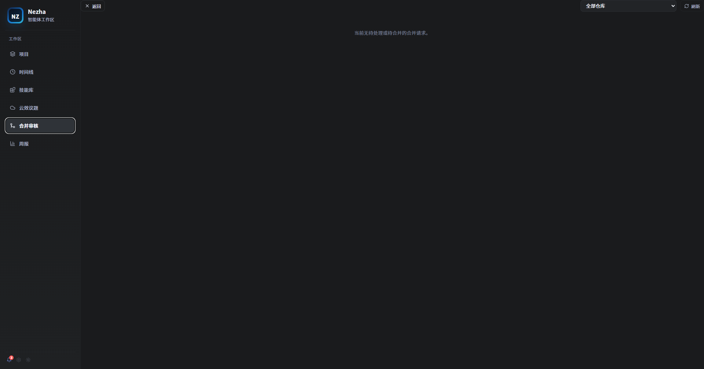

# Nezha 操作手册

> 适用版本：Nezha 桌面端（Tauri 2 + React 19）。
> 本手册覆盖六大功能线：**云效议题闭环**、**知识沉淀**、**技能管理**、**构建**、**知识图谱**、**创建 PR 与合并审核**。
> 阅读对象：使用 Nezha 管理 AI 编程任务，并把结果沉淀回云效、代码库与知识库的团队。

## 0. 环境与前置条件

在使用这些功能线之前，确认以下条件已满足：

| 条件 | 说明 |
|------|------|
| 已安装 Claude Code / Codex | Nezha 通过它们执行 Agent 会话，需能在终端正常调用 |
| 云效 Projex 个人访问令牌 | 格式 `pt-xxxx`，用于读议题、发评论、建 PR/议题；只存于 `~/.nezha/settings.json` |
| 目标仓库已注册为 Nezha 项目 | 欢迎页 →「打开项目」，选定仓库根目录即可 |
| 技能仓库已配置 | 构建、知识图谱、补录议题等能力都依赖技能仓库，先按第 5 节配置来源 |

> 说明：云效访问令牌**不会**写入代码、日志或提交仓库；Agent 进程也不持有该令牌，所有云效写操作都由 Nezha 后端代劳。

---

## 1. 云效议题闭环

云效议题闭环覆盖完整生命周期：**云效看议题 → 选路（直接开始 / 发起讨论）→ 方案讨论或直接执行 → 生成待办拆解 → 提交关联编号 → 回写云效 →（必要时）补录新议题**。核心入口是欢迎页左侧边栏的「**云效议题**」（云朵图标）。

### 1.1 连接云效

首次进入「云效议题」视图会显示连接表单：

1. 填入云效**个人访问令牌**（`pt-xxxx`）。
2. 点「**获取组织**」，拉取当前令牌可见的组织列表；若该令牌只对应一个组织，会自动选中并加载项目。
3. 选择**组织** → 点「**加载项目**」选择**项目**。
4. 可选：填入「我的用户 ID / 我的用户名」（留空则自动探测），用于「只看我负责的」过滤。
5. 点「**保存连接**」。成功后视图顶部显示「`组织名 · 项目名`」。

后续如需切换账号或项目：顶部「**重新连接**」进连接表单；「**刷新**」重新拉取当前项目议题。

连接信息保存在应用级设置（`~/.nezha/settings.json`），每个项目打开时可直接复用，无需重复配置。该令牌同时被「合并审核」「创建 PR」等云效功能复用。

### 1.2 浏览与筛选议题

连接完成后，议题区支持：

- **类别 Tab**：全部 / 需求 / 任务 / 缺陷。
- **项目切换**：顶部下拉可直接切换云效项目，无需重新进设置。
- **状态过滤**：多选状态；「**只看我负责的**」开关（需已正确识别当前用户，否则会提示到连接设置里补填）。
- **搜索框**：按标题或编号模糊搜索（本地过滤）。
- **分页**：每页 100 条，底部「**加载更多**」，顶部显示 `{count} 条议题`。

### 1.3 把议题变成任务：两个入口

议题列表每一行右侧有两个按钮（未勾选任何议题时可见）：

- 「**直接开始**」（实心蓝）——跳过讨论，直接执行该议题。
- 「**发起讨论**」（描边）——进入方案讨论链路，N=1 的单条快捷入口。

议题列表上方的「**导入到项目**」下拉用于选择这两个入口的目标本地项目（会记住上次选择）。

> **关于「已导入」**：若某议题本地已存在绑定任务，按钮区会显示「**已导入**」且不再提供入口，避免重复建任务；这是去重标记，不是一个可点的「导入」操作。把议题落成待办的实际路径只有两条——**发起讨论 →「生成待办」**，或**补录议题**（见 1.6）。

**完整对照（含工作流路由、逐条决策指南与截图）见独立说明**：[Markdown 版](yunxiao-launch-modes.md) · [HTML 版](yunxiao-launch-modes.html)。

### 1.4 发起讨论：先出方案，再执行

点「发起讨论」，在确认框里选择 **Agent**（Claude / Codex / DSH）与**权限模式**（询问 / 自动编辑 / YOLO）、填写「**讨论补充**」，确认后：

1. **打开对话框即已创建 draft 方案（Plan）**，议题详情与图片归档到 `.nezha/plans/<planId>/`；
2. 待办（或新建任务）转化为**方案讨论任务**并立即启动；按议题类别走 `grilling` 决策树（Bug 议题先用 `diagnosing-bugs` 定位根因）；
3. 讨论阶段**先不写代码**，产出一份固定结构的方案文档 `plan.md`。

方案定稿后，从任务头部「**方案**」按钮打开预览，点「**生成待办**」按议题拆成执行任务（一议题一任务，落成 `todo`、不自动启动，由人工把关后运行）。

> 取消对话框会一并清理 draft 方案与已下载图片，不留残留。

### 1.5 直接开始：议题即 spec

点「直接开始」先在确认框里预览议题详情、填写「补充说明（可选）」并选择 Agent / 权限，再点「直接开始」才真正建任务。按议题类别路由：

| 议题类别 | 勾选状态 | 实际工作流 |
|----------|----------|------------|
| 缺陷（Bug） | 复选框不出现 | 先 `diagnosing-bugs` 定位根因（要有可复现证据）→ 再 `implement` |
| 需求 / 任务 | 不勾（默认） | 直接 `implement`，议题描述即 spec |
| 需求 / 任务 | 勾选「先做需求澄清」 | 先 `grilling` 一次一问澄清需求 → 达成共识后立即 `implement` |

直接执行**不生成 `plan.md`**，同样要求提交信息带 `#议题编号`、同样支持完成后的「回写云效」。

### 1.6 补录议题（反向闭环）

如果**讨论 / 执行中途**发现了需要立项的新问题，可以反向补录成正式议题（不打断当前会话）：

1. 在任务运行中，手动调用 `yunxiao-backfill-issue` 技能（该技能位于技能仓库，需已安装到项目）。
2. Agent 先问「**缺陷还是需求**」，再按对应模板逐项盘问（缺陷描述/发生频率/影响范围/业务影响；或需求背景/详细描述/使用频率/紧急程度），并对基础字段做判断（负责人=令牌当前用户，优先级=按价值评分推导，严重程度=Agent 判断，来源默认「内部反馈」，归属项目=当前议题项目）。
3. 汇总成**最终议题预览**，用户确认（可修改），确认即人工闸。
4. Agent 按模板结构写出 `.nezha/drafts/<taskId>/backfill-issue.json`；Nezha 轮询侦测到后，由**持有令牌的后端**调用 `CreateWorkitem` 创建云效新议题 Y。
5. 新议题 Y 生成后，Nezha 自动创建一个**绑定该议题的本地待办任务**（`status=todo`，记录来源任务/来源议题），并在云效描述中写清来源行，便于追溯。

> 新议题默认落成「待办」，**不会自动启动**；由人工把关后进入 1.4～1.7 的常规闭环。

### 1.7 方案回写云效（正向闭环收口）

任务完成后（`done` 且云效绑定任务）：

1. 任务详情头部出现「**回写云效**」按钮；任务列表卡片显示「**待回写**」徽标。
2. 点按钮 → 生成两条评论预览：
   - **开发向评论**：改动内容与「价值评分」由来（素材来自任务的方案文档 / 讨论产物）；
   - **测试向评论**：影响范围与测试指引；
   - 事实骨架含议题编号/标题、关联 commit 短哈希 + 提交信息、变更统计；再由 headless Agent 润色，AI 失败时回退为纯事实模板。
3. 预览可**编辑**，也可「**重新生成**」。
4. 确认后点「**发布评论**」：Nezha 调用云效接口把两条评论追加到议题；「价值评分」小节同时写入云效字段（字段写失败时可「**补写字段**」）。
5. 成功后按钮置「**已回写**」。任务记录 `yunxiaoWrittenBackAt` / `yunxiaoCommentId`，保证幂等，不重复回写。

### 1.8 议题闭环全景

```
云效议题（浏览/筛选）
      │ 二选一
      ├─「直接开始」议题即 spec ─────────────────────────┐
      │                                                 │
      └─「发起讨论」建 draft 方案 → 讨论产出 plan.md      │
                    │                                   │
              方案定稿 →「生成待办」拆出执行任务 ─────────┤
                                                        ▼
                                        执行任务运行中（当前工作区）
                                                        │
                        ┌───────────────────────────────┴───────────────┐
                        │                                               │
                  改动完成、任务 done                        发现新问题 → 补录议题
                        │                                               │
                  回写云效（评论 + 价值评分）                Agent 盘问 → backfill-issue.json
                        │                                               │
                  提交带 #议题编号 自动关联                  Nezha 用令牌建云效议题 + 绑定新待办
                        ▼                                               │
                   议题闭环收口                              └─► 回到「待办」列，人工把关
```

### 1.9 直接开始 vs 发起讨论（怎么选）

| 你的处境 | 选择 |
|----------|------|
| 需求不清楚、影响面大、需要方案留痕 / 人工把关、或要跨多个议题统筹 | 发起讨论 |
| 缺陷根因明确要直接修、一句话说得清的小改动 | 直接开始（不勾澄清） |
| 方向清楚，但验收标准 / 边界细节想和 Agent 对齐一下 | 直接开始 + 勾「先做需求澄清」 |
| 手里这条议题要拆成多个执行任务 | 发起讨论 → 生成待办 |

> 两条链路完成后**都支持回写云效**，选择依据只看：**这次改动值不值得先出一份方案、需不需要人工在方案上把关。** 详细决策指南见 [云效议题完整闭环说明](yunxiao-launch-modes.md)。

---

## 2. 知识沉淀闭环

知识沉淀解决「**Agent 讨论中确认的知识随会话流失**」的问题：把讨论里确认的、且有依据的增量知识，提取出来并格式化成**云效审核议题**，交给知识库负责人审核后更新图谱数据。

> 前置：任务为云效绑定任务，状态 `done`，且项目内已安装/可读取 `knowledge-sedimentation` 技能（知识提取规则所在）。

### 2.1 入口

任务为 `done` 且云效绑定时，任务详情头部在「回写云效」旁出现「**沉淀知识**」按钮（未处理时）；任务卡片可识别处理情况。若任务已记录 `knowledgeIssueIds`，按钮置「**已沉淀**」。

### 2.2 生成候选知识

点「**沉淀知识**」：

- 后端读取 `knowledge-sedimentation` 技能内容，注入 headless prompt。
- 输入包括：会话摘要（约 8000 字截断）、云效议题补充字段与链接、知识图谱 data 目录（现场比对）、项目根代码（用于 `rg` 验证依据）。
- 按「卡片六段骨架」判定优先级：**业务规则/已知坑 > 关键实体/表映射 > 职责修正/依赖补充 > 验证记录**；门槛 = 有依据（代码/文档/用户确认）；排除图谱已有内容、无依据猜测、纯实现细节。
- 输出标签化 JSON，每条含：`模块 / 段落 / 内容 / 依据 / 置信度（已确认|待验证）/ 建议标题`。

### 2.3 预览与编辑

弹窗「**知识沉淀 · 创建审核议题**」列出候选知识：

- 每条可**编辑**内容、依据、标题、置信度。
- 可**勾选**要创建的候选（未勾选的跳过）。
- 无有效候选时提示「未识别到有价值且图谱中没有的知识」；可「**重新生成**」重新提取。

### 2.4 创建审核议题

勾选后点「**创建所选（N）**」：

- 后端调用云效接口，逐条创建到**「知识库图谱」项目**（`Req`；项目 ID 见 `YunxiaoSettings.knowledgeBaseProjectId`，默认 `bc826ccda665f0718511440fac`）。
- 议题标题格式：`【知识沉淀】<模块id>-<知识点摘要>`。
- 议题描述固定模板：来源议题（编号 + 链接）→ 目标模块卡片 → 建议更新段落 → 具体内容 → 依据 → 置信度 → 审核指引。
- **去重**：创建前按标题关键词搜索该项目已有议题，命中则跳过，不重复创建。
- 成功后任务记录 `knowledgeIssueIds`，按钮置「**已沉淀**」；弹窗汇总「已创建 x/y，其余为重复」。

### 2.5 自动回写（可选）与人工审核

在「应用设置 → 技能」中有一个开关「**知识沉淀自动回写**」（提交后经质量门自动写入技能库）：

- **关闭（默认）**：知识只到「创建审核议题」这一步，不入库图谱 `data/`。审核通过后由**知识库负责人**人工更新模块卡片并提交推送（图谱数据由 git 统一管理）。
- **开启**：创建审核议题后，Nezha 立即对「已确认」且有依据的条目跑一次**回写质量门**；全部通过时把知识**追加**写入项目设置中选定的知识图谱模块卡片、推送技能库，并把该议题置为「已完成」。未通过的条目保留人工审核。

> 自动回写是**只增不改**（在匹配的卡片段落末尾追加），且不会覆盖该卡片尚未提交的手工改动。

---

## 3. 技能管理

Nezha 用**技能仓库**统一管理技能：一个来源（本地目录或 git 远端），通过**软链**安装到各项目/全局；技能内容随仓库版本走，更新后已安装项零成本跟随。

### 3.1 入口

- **技能库视图**：欢迎页左侧「**技能库**」（积木图标）→ `SkillHubView`。
- **来源配置**：欢迎页右下角齿轮 → 应用设置 →「**技能**」→ `SkillsPanel`。

### 3.2 配置技能来源

在「应用设置 → 技能」选择来源类型：

**本地目录**
- 选一个含技能子目录（每个子目录有 `SKILL.md`）的文件夹。确定后 Nezha 把它注册为一个特殊项目，可在任务视图内编辑技能。

**git 远端**
- 填仓库 URL（仅允许 `https://` 或 `git@`，拒绝其它协议与本地路径伪装）+ 可选分支（缺省跟随远端默认分支）。
- 点「**保存并同步**」：首次自动 `git clone --depth 1` 到 `~/.nezha/skill_repos/<sanitized-repo-name>/`；已存在则 `git fetch` 探测变更，**有变更才** `--ff-only` 拉取（不自作聪明 `reset`，不覆盖本地改动）。
- 面板下方展示解析后的**技能库路径**、上次同步时间、当前 commit，及同步失败标记。

> 同步失败/离线时，Nezha 继续使用上次缓存，来源标记 `stale`（过期）并记录错误，UI 可手动重试。

### 3.3 同步与状态

进入「技能库」视图：

- 头部显示：来源类型、来源地址、**上次同步时间**、**当前 commit**（前 12 位）、同步失败标记（`同步失败，使用缓存技能: <错误>`）。
- 「**立即同步**」按钮：手动触发一次同步。
- **自动探测**：启动时异步一次 + 窗口聚焦 + 每 30–60 分钟周期探测；本地路径来源用文件变更监听（`notify`）实时重扫。
- 「**在任务视图中打开**」：进入技能库项目，用代码/文件视图直接编辑技能。

### 3.4 安装技能到项目

技能列表中每条技能：

1. 点「**管理**」→ 弹窗「**安装到项目**」。
2. 选择目标项目与 Agent（Claude / Codex），或选择「**全局**」（装到 `~/.claude/skills`、`~/.codex/skills`，所有项目可用）。
3. 确认安装 —— 该技能**在你的项目中以软链存在**，指向 Hub 内的技能目录。因此 Hub 内容更新后，已安装技能自动跟随，无需重装。

健康检查标记：`ok`（正常） / `broken`（软链目标丢失） / `diverged`（路径在 Nezha 之外被修改）。

### 3.5 技能数据管理

若技能安装到项目且技能目录含声明数据目录（如 `his-knowledge-graph/data/`）：

- 在「管理」弹窗的数据区可：**打开数据文件夹**、**备份**到指定路径、**重新构建**（用于技能派生数据生成）。
- 数据目录由 `NEZHA_SKILL_DATA_DIR` 等环境变量注入，随技能仓库 git 统一管理。

### 3.6 失效安装与删除

- **清理失效安装**：「技能库」工具栏「**清理全部失效安装**」——只删除指向失效目标的软链与安装记录，**不删除任何普通目录**。
- **删除技能**：每条技能右侧垃圾桶 → 默认会删除技能目录 + 所有安装软链（有二次确认）。
- 技能被改名/删除后，已安装项目健康标记会变为 `broken`/`diverged`，由用户手动卸载，Nezha 不做自动删除。

### 3.7 SkillHub 任务视图

技能库作为特殊项目注册进 `projects.json`，你可以在普通任务/文件/终端视图里打开它，像编辑普通项目一样编辑技能内容（适合在讨论中直接改技能再提交）。

---

## 4. 构建

面向 HIS 这类 .NET Framework 大解决方案的**一键多仓库拉取 + 依赖拓扑编译**面板，负责「拉代码 → 排依赖 → 编译 → 收集报错 → 派发修复任务」。

### 4.1 入口与前置

- 进入项目后，点右侧工具栏的**锤子图标**（悬停提示「**构建**」），右侧展开「**构建**」面板；面板右上角「**全屏**」可进入专注监视器。
- 前置：目标项目为 git 仓库；已安装 `hsp-build-order` 技能（提供 `hsp-build-order.ps1`，用于解析解决方案与依赖排序）；机器具备 VS18 `MSBuild.exe`、NuGet 缓存与共享输出目录（含外部 dll）。
- 若面板显示「未发现 git 仓库」，点「**刷新**」重新探测。



### 4.2 仓库拉取

- 「**仓库拉取**」列出自动推导的仓库：主仓库 + `.gitmodules` 子模块（当前只展示 HIS / DrugInOut / Term）。
- 每个仓库可**独立切换分支**（下拉），并显示当前分支 / `脏`（有未提交改动）/ `缺失` 状态。
- 勾选要拉取的仓库 → 点「**拉取**」：
  - 走 `git pull --ff-only --no-rebase`；**脏仓库会被阻断**（绝不 stash / reset）；
  - 远端跟踪引用陈旧导致失败时自动 `git fetch --prune --force origin` 后重试；
  - 结果显示为压缩摘要（`✓/× 仓库: 摘要`）。
- 「**刷新基线**」把当前各仓库 HEAD 写入 `.nezha/build-state.json`，作为增量构建的比较基准（不编译）。

### 4.3 分析 / 计划

点「**分析/计划**」：以 `-DryRun` 生成**阶段流水线、依赖图、循环组、外部 dll 引用清单、引用健康**（重复引用 / TFM 低于被引用项目）与环境检查（NuGet 还原 / VS18-RID 兼容 / 外部 dll 缺失），写入 `Log/build-plan.json`。**不编译**。

「环境检查」卡片会显示：外部依赖 dll 引用数、缺失项、版本冲突、引用健康问题；「阶段流水线」按阶段列出各工程状态。

### 4.4 运行构建

- **构建模式**：`全量` / `增量` / `仅失败`。
- **增量范围**：默认**只编 git 变更文件直接命中的工程**（对比 `.nezha/build-state.json` 的基线 commit，覆盖已提交、已暂存、未暂存改动与未跟踪新文件）。因为本解决方案的工程之间是 HintPath 引用共享目录 dll（不是 `ProjectReference`），改动不会自动传播到依赖方，所以默认不扩散反向依赖闭包——否则实测 4 个变更工程会被放大成 100+ 个。
  - 若改了公共 API / 基类，需要把依赖方一起编，勾选「**附带反向依赖方**」即可恢复闭包语义。
  - 增量与仅失败模式**跳过坏状态清理**（不搬移 `obj`），保证增量编译复用中间产物；需要清理 `obj` 时用「全量」。
- 点「**运行构建**」：子进程跑 `hsp-build-order.ps1`，按依赖拓扑（就绪波）编译；`MaxParallel` 控制并发（默认 2，1=串行）。运行中显示**进度 `N/总数 · xx% · 阶段`**、进度条与**用时**；「**取消**」整树终止（含 MSBuild / dotnet）。
- 成功自动刷新构建基线；失败保留在全屏监视器里便于排查。

### 4.5 错误清单与修复

- 构建失败后生成「**错误信息列表**」：每个失败项目 + `error` 行 + `依赖失败: ...`（链式）/ `[工具链] ...` 诊断。
- 每项一个 **checkbox**：勾选 = 标记已修复，持久化到 `.nezha/build-fix-status.json`。
- 按钮：
  - 「**发起修复任务**」：新建 agent 任务（当前工作区、YOLO 全权限），prompt 指引 agent **先读取 `Log/build-errors.txt` → 总结错误类别 → 逐个修复并重编验证 → 把修好的项目名写入 `.nezha/build-fix-status.json` 的 `fixed` 数组**，最后刷新构建基线。
  - 「**导出错误信息**」：把错误列表写入 `Log/build-errors.txt`，按钮旁显示导出结果。
- 修复后重跑：切到「**仅失败**」模式，只编未勾选的失败项 + 依赖方，快速验证；通过后再「全量」。

### 4.6 构建配置

`[build]` 配置项（`.nezha/config.toml`，面板「构建配置」可改其中一部分）：

| 字段 | 说明 |
|------|------|
| `script_path` | `hsp-build-order.ps1` 路径（留空自动探测，通常走 SkillHub 托管副本） |
| `msbuild_path` | VS18 `MSBuild.exe`（留空自动探测） |
| `max_parallel` | 并行度（1=串行，2–8 并行） |
| `auto_fix_on_failure` | 构建失败时自动发起修复任务（默认 `false`；同一批失败工程只自动发起一次） |
| `solution / configuration / platform / external_dll_dir / skip_*` | 对应 ps1 参数，一般无需手改 |

> 相关文件：`.nezha/build-state.json`（增量基线）、`.nezha/build-fix-status.json`（修复标记）、`Log/build-plan.json`、`Log/build-errors.txt`。
> 该面板面向 Windows + PowerShell + MSBuild 场景。更细的构建脚本说明见 `docs/build-tool-manual.md`。

---

## 5. 知识图谱

知识图谱是 Agent 的「项目认知底座」：把模块职责、关键实体、数据表、业务规则、已知坑等固化成**模块卡片**，供讨论/执行时查阅，也让沉淀的知识有处可落。分两个操作面。

### 5.1 入口

- **浏览 / 编辑**：项目右侧工具栏「**知识库**」（书本图标）——浏览并编辑当前项目绑定图谱的模块卡片。
- **绑定 / 初始化 / 扫描**：项目「**设置**」→ 左侧「**知识库**」。



### 5.2 面板：浏览、编辑与推送

右侧「知识库」面板展示当前项目绑定图谱的模块卡片：

- 顶部显示卡片数量与「**提交并推送（N）**」；有未提交改动时卡片带「**已改**」标记。
- 「**搜索模块卡片**」按模块名过滤。
- 点某张卡片会在主窗口以 Markdown 页签打开，可直接编辑（自动保存），也可提交推送。
- 未绑定图谱时提示「当前项目未绑定知识库，请到项目设置中配置。」

### 5.3 设置：图谱绑定与维护

项目「设置 → 知识库」：

- **图谱绑定**：下拉选择要绑定的知识图谱（或「未配置」表示不启用）。提示语说明「讨论上下文、知识沉淀、质量门和自动回写都使用该目标」。
- 已绑定图谱显示状态（如「**已就绪 · <适配器>**」），并提供两个按钮：
  - 「**扫描项目**」：跑 `bootstrap.py --mode scan` 依据项目代码重建 `index.md` / `graph.json`，**已有模块卡片不会被覆盖**；
  - 「**管理模块卡片（N）**」：进入卡片管理模式，可**新建 / 编辑 / 重命名 / 删除**卡片，并「**提交并推送（N）**」。
- **新建图谱**：填「图谱 ID」「图谱名称」、选「选择适配器」，点「**创建**」新建一张图谱并绑定到当前项目。



### 5.4 数据与约束

- 图谱数据由技能仓库统一管理：`knowledge-graphs/<图谱ID>/graph.toml`（清单：id/name/adapter）与 `knowledge-graphs/<图谱ID>/data/modules/*.md`（模块卡片）；脚本在 `knowledge-graph/`（`bootstrap.py` 与 `adapters/<adapter>.py`）。
- 项目绑定写在 `.nezha/config.toml` 的 `[knowledge] graph_id`；留空 = 不启用。
- 「已就绪」需同时具备 `data/modules` 与 `knowledge-graph/` 脚本目录；「扫描项目」还需存在对应适配器。
- 需先配置技能仓库（第 3 节），否则提示「技能库未配置，无法选择知识库」。
- 本面板与「知识沉淀」（第 2 节）的关系：沉淀从会话提取候选并创建**云效审核议题**；本面板负责**查看 / 编辑 / 推送图谱数据本身**。开启「知识沉淀自动回写」后，确认过的知识也会自动落到这里的卡片。

---

## 6. 创建 PR

把一批已完成的议题改动，打包成「批次 + 分支 + worktree」，再推送成一个云效 Codeup 合并请求（MR）。认证复用「云效议题」里配置的令牌与组织（第 1.1 节），无需单独配置。

### 6.1 新建 PR

进入项目后，点右侧工具栏「**PR**」图标，展开 PR 面板 → 点「**新建 PR**」：



在「**创建 PR**」对话框中填写：

| 字段 | 说明 |
|------|------|
| **代码目录** | worktree 创建位置（点「选择」挑目录，不自动复制运行程序） |
| **批名称** | 如「门诊挂号优化」 |
| **类型** | `feature · 日常开发` / `patch · 现场响应` / `release · 上线验收` / `hotfix · 补丁` |
| **源分支** | 点「检测」校验是否与远端 / 本地重名，冲突时可「继续使用远端分支」或「改名」 |
| **基础分支** | 从哪个分支切出 |
| **合并回目标分支** | MR 的合并目标 |
| **选择议题** | 勾选组成该批次的议题（顺序即任务顺序） |

点「**创建批 + 分支 + worktree**」完成创建。之后批卡片上可「**打开**」「**删除 WorkTree**」，或点「**提交 MR**」。

### 6.2 提交合并请求

点「**提交 MR**」→「**提交合并请求**」对话框：

- 可填「**审核人**」（默认取目标分支管理人员，可编辑，逗号分隔）；
- 确认后点「**提交到 Codeup**」——Nezha 先把批次分支推送到远端，再调用 Codeup 接口创建 MR，并把 MR 状态回写到该批次。

---

## 7. 合并审核

欢迎页左侧「**合并审核**」进入合并审核中心，集中处理各仓库**待处理 / 待合并**的 MR —— 从拉代码、审查、合并，到把审查报告回写到云效评论。

### 7.1 入口与列表



- 顶部「**全部仓库**」下拉筛选仓库、「**刷新**」重新拉取。
- 每张 MR 卡片显示：
  - 状态徽标：**评审中 / 待合并 / 已合并 / 已关闭 / 已通过**，以及 **有冲突**；
  - `源分支 → 目标分支`、所属仓库、**作者**、**审核人**。

### 7.2 四个操作

| 操作 | 作用 | 前置 / 说明 |
|------|------|-------------|
| **拉取代码** | 把 MR 的源分支拉到本地临时仓库 | 完成后按钮变「重新拉取」；合并前必须先做这一步 |
| **代码审查** | 启动 Agent 任务，按 `merge-code-review` 技能出具审查报告 | 任务名形如 `代码审查 <标题>` |
| **分支合并** | 启动 Agent 任务，把源分支合并并推送到目标分支 | **需先拉取代码**；报告含阻止级 `fail` 会二次确认 |
| **查看审查结果** | 打开审查报告弹窗 | 无报告时提示先执行「代码审查」 |

> 「代码审查」与「分支合并」都是**启动真实 Agent 任务**，并非直接调平台 API 一键完成；合并最终由 Agent 在本地 git 推送（默认 fast-forward，不 force）。

### 7.3 审查报告

「**查看审查结果**」弹窗内可：

- 「**回写到评论**」：先进入可编辑态（可改 Markdown，带字数提示），确认后作为**整体评论**发布到云效 MR；
- 「**复制**」：复制全文到剪贴板；
- 「**导出 .md**」：导出为本地 Markdown 文件。

### 7.4 临时仓库与认证

- 合并审核用到的临时仓库默认放在 `~/.nezha/codeup_worktrees/`；可在「应用设置 → Git 和源代码设置」的「**临时仓库基路径**」里改。
- 认证复用云效个人访问令牌，若未配置会提示先到「云效议题」里完成连接。

---

## 8. 常见问题

| 现象 | 处理 |
|------|------|
| 云效「获取组织」失败 / 列表为空 | 检查令牌是否有云效 Projex 读权限；确认组织在令牌可见范围内。 |
| 「只看我负责的」不可用 | 当前用户未能自动识别，到连接设置补填「我的用户 ID / 用户名」后重试。 |
| 议题行显示「已导入」，没有入口 | 该议题本地已有绑定任务（去重标记）。到对应项目「待办」列找它，或删除旧任务后重新发起。 |
| 想把一条议题直接落成待办 | 没有单独的「导入」按钮了；请用「发起讨论 → 生成待办」，或对已存在的任务直接操刀。 |
| 发起讨论后 Agent 读不到议题图片 | 图片在发起时下载；若任务重跑/恢复，图片可能已随任务清理，可重新发起或用附件补图。 |
| 提交信息不含 `#编号` | `git_commit` 会自动追加；`merge_task_worktree` 会校验并阻断缺失提交（去对应提交补 tag）。 |
| 「回写云效」后没有出现在议题 | 确认云效工作项「评论」权限；如价值评分字段写入失败，用「补写字段」。 |
| 「沉淀知识」无候选 | 说明本次讨论没有图谱之外的、有依据的增量；可「重新生成」或换更聚焦的知识技能后再试。 |
| 知识沉淀后没人去改图谱 | 在「应用设置 → 技能」开启「知识沉淀自动回写」，确认过的知识会经质量门自动写入绑定图谱。 |
| 技能库显示「同步失败，使用缓存技能」 | 网络/凭据问题。检查 URL/分支、网络，点「立即同步」重试；失败时不阻塞使用缓存。 |
| 已安装技能健康标记 `broken`/`diverged` | Hub 里技能被改名/删除，或路径被外部修改；手动卸载或清理失效安装（不会删除普通目录）。 |
| 构建面板显示「未发现 git 仓库」 | 点面板「刷新」重新探测；确认项目根确是 git 仓库。 |
| 构建报「找不到 hsp-build-order.ps1」 | 到「构建配置」填写 `script_path`，或确认技能仓库已配置且装了 `hsp-build-order` 技能。 |
| 增量构建报「未检测到变更」/「请先建立基线」 | 先跑一次「全量构建」或点「刷新基线」建立基线；随后再增量。 |
| 「扫描项目」按钮灰着 | 图谱未就绪或缺对应适配器脚本；先在设置里确认图谱「已就绪」，并保证 `adapters/<adapter>.py` 存在。 |
| 「知识库」提示「技能库未配置」 | 先到「应用设置 → 技能」配置技能仓库来源。 |
| 「分支合并」点不动 | 需先对该 MR「拉取代码」。 |
| 创建 PR 报分支重名 | 用「检测」后选「继续使用远端分支」或「改名」。 |
| 审查报告「回写到评论」失败 | 确认云效令牌有合并请求评论权限；报告本身可先「复制」或「导出 .md」保底。 |
| 合并审核列表一直为空 | 当前筛选仓库下确实没有待处理 / 待合并的 MR；换「全部仓库」或点「刷新」。 |

