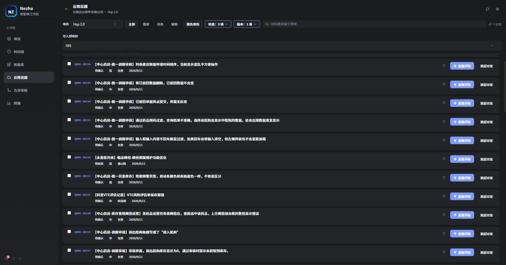
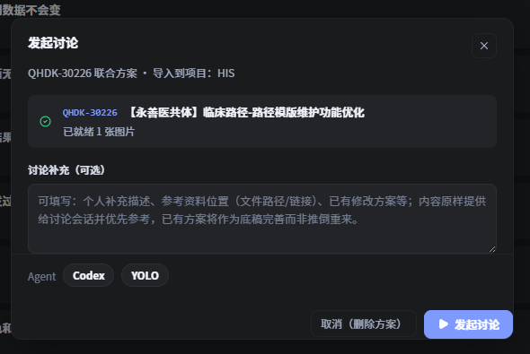
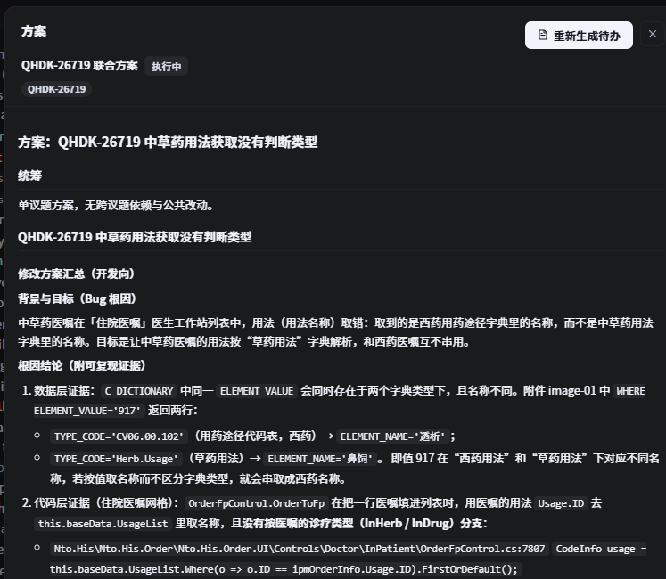
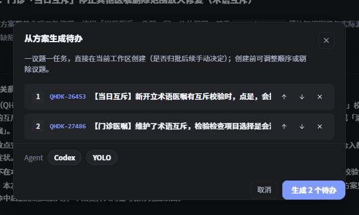
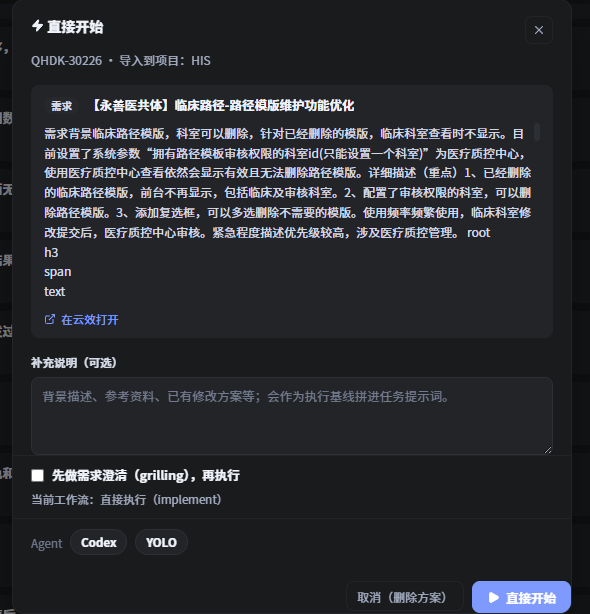
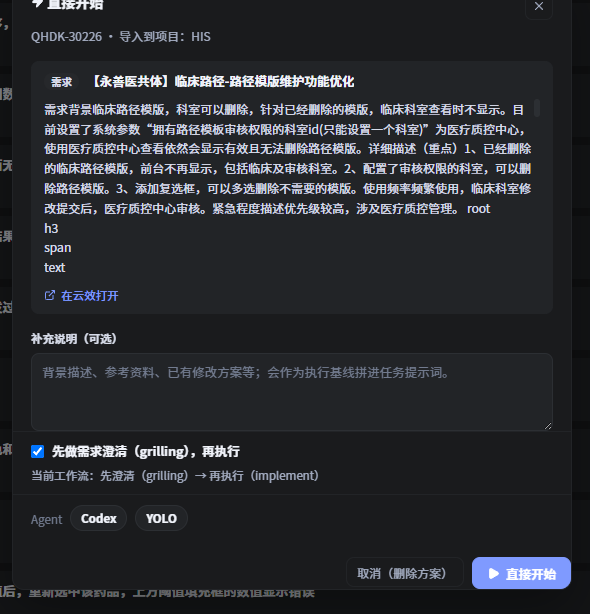
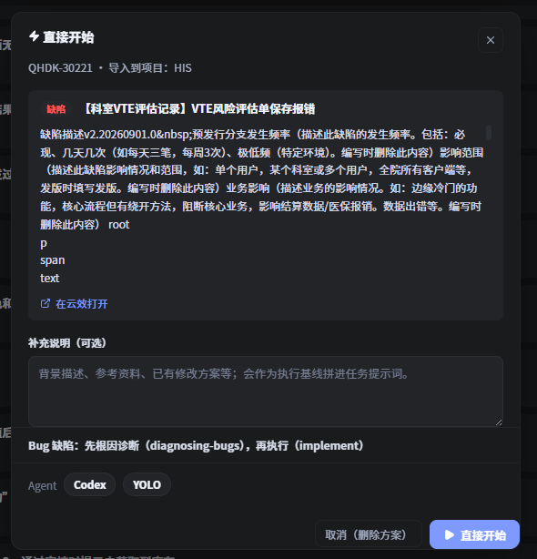
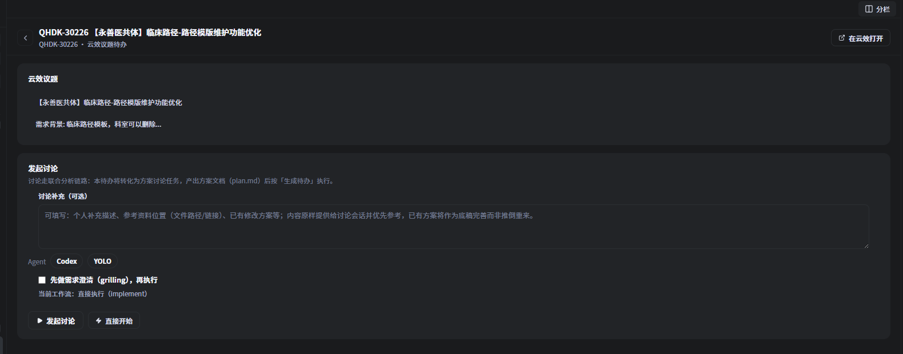
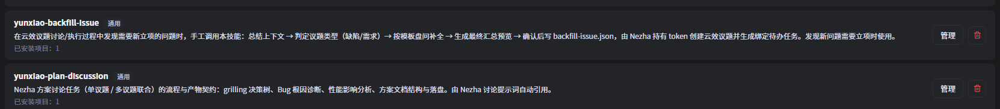

# Nezha 使用说明：云效议题的完整闭环

> 适用版本：Nezha 桌面端（Tauri 2 + React 19）。
> 阅读对象：把云效议题变成 AI 编程任务的使用者。
> 配套：本说明是 [操作手册](operation-manual.md) 第 1 节「云效议题闭环」的细化补充，把一条议题从**进入**到**回写**、以及在任务中途**生成新议题 / 新待办**的全过程讲清楚。

一条云效议题在 Nezha 里有两条进入方式，运行中还有两条生成方式。先看总览，再逐段展开：

```
┌─ 进入 ─────────────────────────────────────────────────────────────┐
│  云效议题列表                                                       │
│    ├─「直接开始」议题即 spec，直接跑执行任务                          │
│    └─「发起讨论」先出 plan.md 方案，定稿后「生成待办」再跑执行任务      │
└────────────────────────────────────────────────────────────────────┘
┌─ 任务运行中生成 ───────────────────────────────────────────────────┐
│  「生成待办」方案定稿后按议题拆出执行任务（一议题一任务）              │
│  「补录议题」发现新问题→立项，创建云效新议题 + 自动绑定新待办          │
└────────────────────────────────────────────────────────────────────┘
┌─ 收口 ─────────────────────────────────────────────────────────────┐
│  任务 done →「回写云效」评论 + 价值评分；提交带 #议题编号 自动关联     │
└────────────────────────────────────────────────────────────────────┘
```

一句话概括两个入口的区别：**它们都能把一个议题变成真实运行的 Agent 任务，都会绑定议题、都会在完成后回写云效；真正的区别在于中途要不要经过「方案讨论」这一环。**

- **发起讨论** = 先让 Agent 把议题想清楚、产出一份 `plan.md` 方案，再决定怎么执行。**先方案，后动手。**
- **直接开始** = 议题内容本身就是 spec，Agent 读完直接改代码。**边想边做，没有方案文档。**

---

## 1. 两个入口长什么样

进入「云效议题」视图（欢迎页左侧云朵图标），每一行议题右侧都是这一组按钮：



- 「**直接开始**」（实心蓝）——跳过讨论，直接执行该议题。
- 「**发起讨论**」（描边）——进入方案讨论链路，N=1 的单条快捷入口，和「多选几条后底部统一发起」是同一条链路。

> 未选中任何议题时两个按钮都可见；一旦勾选了议题（进入多选模式），行内按钮会隐藏，改为底部统一的「发起讨论」批量入口。多选只支持「发起讨论」，不支持批量「直接开始」——因为直接执行是「一议题一任务」，不适合批量。

---

## 2. 「发起讨论」：先出方案，再执行

### 2.1 对话框

点「发起讨论」后弹出确认框：



对话框里能看到：议题已拉取成功（打勾）、已归档的图片数量、可选的「讨论补充」，以及 Agent / 权限模式选择。

### 2.2 打开即建方案占位

「发起讨论」和「直接开始」最大的流程差异在这里：**打开对话框的瞬间，Nezha 就已经为你创建了一个 draft「方案（Plan）」**，并把议题详情、图片下载到方案目录 `.nezha/plans/<planId>/` 下。

因此：

- 对话框里如果拉取失败，可以「重试」或「剔除」这一条；
- 直接关闭 / 点「取消（删除方案）」会把这个 draft 方案和已下载的图片一起删掉，**不留残留**。

### 2.3 讨论产出什么

确认发起后，待办（或新建的任务）会变成一条**方案讨论任务**并立即启动。Agent 读取 `yunxiao-plan-discussion` 技能，按技能定义的流程走：

| 议题类别 | 讨论阶段做什么 |
|----------|----------------|
| 需求（Req）/ 任务（Task） | 用 `grilling` 决策树把议题问清楚：一次只问一个问题、每个问题先给推荐答案、能查证的事实自己查；走完目标与边界、验收标准、关键取舍 |
| 缺陷（Bug） | **先**用 `diagnosing-bugs` 方法论定位根因（先搭一条能变红的命令，再复现、最小化、提假设，结论要有可复现证据），根因确认后才进入方案产出 |

两种类别在讨论阶段都**先不写代码**，产物是一份**方案文档 `plan.md`**（落在 `.nezha/plans/<planId>/`）。文档结构是固定契约：

- `## 统筹` 一节（跨议题的公共改动归属、依赖与执行顺序；单议题也要有）；
- 每个议题一个 `## <议题编号> <标题>` 节，节内三个小节按固定顺序：`### 修改方案汇总（开发向）` → `### 性能影响分析` → `### 影响范围与测试（测试向）`；
- 「性能影响分析」**每议题必填**：命中热路径要给出代码/调用链依据，判定「可忽略」也要写明理由。

**关键点：讨论阶段通常不改业务代码，它只产出方案。真正的代码改动发生在「生成待办」之后的执行任务里。**

### 2.4 方案定稿 → 生成待办

讨论任务结束时（手工「标记已完成」或会话自然退出），方案从 `draft` 转为 `finalized`（定稿）。此时从任务头部的「**方案**」按钮打开方案预览：



右上角的「**生成待办 / 重新生成待办**」就是讨论链路通往执行链路的闸门。点开后进入「从方案生成待办」确认页：



这一页可以做的事：

- **调整执行顺序**：每条议题右侧的上/下箭头；
- **剔除议题**：右侧 ×，剔除的议题不生成任务；
- **冲突议题自动排除**：若某议题已被单独导入过（本地已有绑定任务），会标注「已被单独导入，自动跳过」，不重复生成；
- **选择 Agent / 权限模式**（按项目记忆）。

点「**生成 N 个待办**」后：

1. 每个议题生成一条 **`todo` 任务**——一议题一任务，直接在当前工作区创建（**不自动启动，也不建 worktree**）；
2. 方案状态转为 `executing`，记住本次确认的议题与顺序；
3. 任务落到项目「待办」列，由人工把关后再启动执行；
4. 任务提示词里内联了「方案统筹」+「本议题方案」两段，并要求只改本议题相关改动、提交信息带 `#议题编号`。

> 方案定稿后的**任何状态**都可以「重新生成待办」（执行中、已完成都行），比如旧待办被取消删除后想重跑。只有「讨论中」会锁定——因为此时 `plan.md` 仍在被会话覆盖更新。
>
> 这个确认页的「**取消**」只关闭弹窗，**不会删除方案**（与「发起讨论」弹窗里的「取消（删除方案）」语义不同，注意区分）。

### 2.5 多议题联合分析

勾选多条议题后从底部发起，走的是同一条链路，但会做**跨议题统筹**：一份 `plan.md` 覆盖全部议题，统一排序、识别公共改动归属。单次讨论有软上限（10 条，源于上下文与图片量的现实约束），超出会提示。

---

## 3. 「直接开始」：议题即 spec，直接执行

### 3.1 确认对话框（三种形态）

点「直接开始」不会立即建任务，而是**先弹一个确认对话框**。这个对话框是「零副作用」的——打开不建任务、不下图，取消什么都不留下。

对话框会根据议题类别呈现三种不同形态。

**形态 A：需求 / 任务类，默认直接执行**



需求类议题默认工作流是「直接执行（implement）」。

**形态 B：需求 / 任务类，勾选「先做需求澄清」**

勾上「**先做需求澄清（grilling），再执行**」后，工作流变为「先澄清（grilling）→ 再执行（implement）」：



**形态 C：缺陷类，锁定根因诊断**

如果议题是「缺陷（Bug）」，澄清复选框不会出现，取而代之的是一行锁定的提示——Bug 恒走「先根因诊断（diagnosing-bugs），再执行」：



对话框里可做的事：

- 只读预览议题详情（拉取失败不阻断，会提示「描述以下方补充为准」）；
- 填「**补充说明（可选）**」：背景描述、参考资料路径/链接、已有修改方案等，会作为执行基线拼进任务提示词，优先于议题描述；
- 确认 **Agent**（Claude Code / Codex / DSH）与**权限模式**（询问 / 自动编辑 / YOLO），这两个选择按项目记忆。

### 3.2 工作流如何路由

| 议题类别 | 勾选状态 | 实际工作流 |
|----------|----------|------------|
| 缺陷（Bug） | 复选框不出现 | 先 `diagnosing-bugs` 定位根因（要有可复现证据）→ 再 `implement` |
| 需求 / 任务 | 不勾（默认） | 直接 `implement`，议题描述即 spec |
| 需求 / 任务 | 勾选「先做需求澄清」 | 先 `grilling` 一次一问澄清需求 → 达成共识后立即 `implement` |

> **Bug 优先于澄清**：即便你事先勾了澄清，只要议题是 Bug，也只会走 `diagnosing-bugs`。因为 Bug 的取证循环本身就会盘问，再叠加一轮需求澄清会变成两个技能各问一遍、互相打架。

### 3.3 确认后发生什么

点「**直接开始**」才真正创建任务：

1. 在目标项目里创建一条 `pending` 任务，切到项目视图；
2. **后台**拉取议题详情 + 下载图片到任务附件目录 `.nezha/attachments/<taskId>/`；
3. 拼装提示词（议题信息 + 描述 + 图片 + 你的补充 + 协作约束）后**自动启动** Agent，在**当前工作区**运行（不建 worktree）。

失败处理与「发起讨论」一致，但两种入口的落点不同：

- **从议题列表发起**：任务已创建，若详情拉取失败或图片全部失败 → 任务置 `failed` 并带原因、不启动；图片部分失败 → 警告放行。重试方式是删掉任务重新发起。
- **从云效待办发起**：待办原地保持 `todo` 不动，只弹错误提示、可直接重试，不会留下失败任务。

> 直接执行**不生成 `plan.md`**，议题内容就是唯一 spec。它同样会要求提交信息带 `#议题编号`、同样支持完成后的「回写云效」；工作产物（含价值评分、影响范围与测试）写到 `.nezha/drafts/<taskId>/discussion.md`，作为回写素材。

---

## 4. 云效绑定待办里的双入口

如果议题已经被导入成项目里的待办任务（「待办」列里的云效议题卡片），点开它会进入**云效议题待办视图**，这里同样有「发起讨论」和「直接开始」两个按钮：



和议题列表的区别：

- 待办视图里的「发起讨论」是**待办自身转化为方案讨论任务**，不会新建任务；
- 「直接开始」也是**待办原地转为执行任务**；
- 「先做需求澄清」复选框内联在这里；**议题详情尚未加载完时它是禁用状态**，等详情就绪才能勾；若详情确认是 Bug，则会换成锁定的根因诊断提示。

---

## 5. 任务运行中生成议题：补录议题

前面讲的都是**给定议题**怎么开工。但真实开发里经常是反过来的：**任务跑到一半，讨论/执行中发现了一个新问题，需要单独立项。** 这时候用「**补录议题**」。

### 5.1 它是什么

补录议题是一条**反向闭环**：不打断当前会话，把一个新发现的问题补录成正式云效议题，并自动生成一条绑定该议题的本地待办，来源可溯（能查到是哪个任务、哪次讨论发现的）。

它由 `yunxiao-backfill-issue` 技能驱动，需要该技能已安装到项目（SkillHub 里可安装，如下图两条议题相关技能）：



### 5.2 怎么用（Skill 侧）

在当前任务的会话里**手工调用**该技能（例如 `/yunxiao-backfill-issue`，或「用 yunxiao-backfill-issue 技能把这个问题立项」）。Agent 会：

1. **总结上下文**：从当前会话把「未立项的新问题」拎出来，归纳成自包含描述（不编造会话里没有的事实）；
2. **判定类型**：先问「这是一个缺陷还是需求？」，**不默认**；
3. **读模板**：按类型打开技能目录下的 `templates/bug.json` 或 `req.json`；
4. **逐项盘问**：按模板的内容段一次问一段，并给出模板里的引导语（缺陷：缺陷描述/发生频率/影响范围/业务影响；需求：需求背景/详细描述/使用频率/紧急程度描述）；
5. **拟标题**：从上下文拟一个，交你确认（可改）；
6. **最终预览**：把「标题 + 各内容段 + 自动回填的基础字段」一次性展示，要求「确认创建 / 修改」；**确认前不写任何文件**；
7. **落请求**：你确认后，Agent 把结构化请求写进 `.nezha/drafts/<taskId>/backfill-issue.json`。

基础字段不是逐项盘问的，按规则自动回填：

| 字段 | 取值 |
|------|------|
| 负责人 | 云效令牌当前用户 |
| 优先级 | Agent 判断（复用 `issue-value-scoring` 的优先指数/核心指数定档） |
| 严重程度 | Agent 判断（Bug 走 value-scoring 的严重程度维度）或模板默认 |
| 来源 | 默认「内部反馈」 |
| 归属项目 | 取当前议题所在云效项目 |
| 所属产品 | **必填且由你选择**（Agent 先据上下文给候选） |

### 5.3 怎么用（Nezha 侧）

技能只负责把请求写进草稿文件，**建议题和建待办由 Nezha 完成**：

1. 云效任务运行期间，Nezha 每约 4 秒扫描一次活跃任务的草稿目录；
2. 检出 `backfill-issue.json` 后，用**自己持有的令牌**调云效 `CreateWorkitem` 创建新议题 Y（Agent 进程始终不持有令牌，也不直接调云效 API）；
3. 自动生成一条**绑定 Y 的 `todo` 待办**，记录 `derivedFromTaskId` / `derivedFromWorkitemId` 溯源字段，云效描述里也带来源行；
4. 写消费标记、清掉草稿。

几个关键性质：

- **不自动启动**：新议题落成待办，由人工把关后再走常规闭环（第 2～4 节）；
- **幂等**：同一来源 + 同一内容签名只建一次；若议题已建但本地待办缺失（中断/历史孤儿），会据标记里的 workitemId 补建，保证议题 ↔ 待办 1:1；
- **失败可重试**：创建失败或网络错误时保留草稿，后续轮询自动重试；
- **人工闸在写文件之前**：用户不确认，就不会产生议题。

---

## 6. 完整流程全景

把两条进入链路、两条生成链路与回写收口画在一起：

```
                         ┌──────────────────────────────┐
                         │      云效议题列表 / 待办       │
                         └──────────────┬───────────────┘
              ┌─────────────────────────┴─────────────────────────┐
              │                                                   │
        「直接开始」                                        「发起讨论」
   议题即 spec，零方案占位                          打开即建 draft 方案（占位）
              │                                                   │
              │                                    讨论任务：grilling / diagnosing-bugs
              │                                                   │
              │                                          产出 plan.md（方案文档）
              │                                                   │
              │                                     讨论任务 done → 方案 finalised
              │                                                   │
              │                                        【生成待办】拆出 N 个执行任务
              │                                                   │
              └───────────────────────┬───────────────────────────┘
                                      │
                              执行任务运行中
                                      │
                    ┌─────────────────┴──────────────────┐
                    │                                    │
              改动完成、任务 done              发现新问题 → 【补录议题】
                    │                                    │
              【回写云效】                        Agent 盘问 → 写 backfill-issue.json
        评论（开发向 + 测试向）+ 价值评分                    │
                    │                            Nezha 用令牌建云效议题 Y
             提交带 #议题编号 自动关联                        │
                    │                            自动生成绑定 Y 的新待办（todo）
                    ▼                                    │
              议题闭环收口                                 └──► 回到「待办」列，
                                                              人工把关后重新进入闭环
```

两个容易混的「生成」动作，一句话区分：

| 动作 | 输入 | 输出 | 在哪触发 |
|------|------|------|----------|
| **生成待办** | 已定稿的 `plan.md` | N 个执行 `todo` 任务（一议题一任务） | 方案预览 →「生成待办」 |
| **补录议题** | 运行中发现的**新问题** | 云效**新议题** + 绑定新 `todo` | 会话中手工调用技能 |

---

## 7. 到底怎么选：决策指南

### 7.1 用「发起讨论」，当……

- **需求还不清楚**：议题描述笼统、边界模糊，你希望 Agent 先把问题问明白、拿出方案再动手；
- **影响面大**：涉及多个模块、多张表、前后端联动，值得先评审方案再改；
- **需要留痕**：你要一份 `plan.md` 作为「为什么这么改」的依据，供评审、复盘或回写云效引用；
- **多议题**：几条议题彼此关联，需要跨议题统筹、统一排序、识别公共改动；
- **要人工把关**：你想在「方案 → 生成待办 → 执行」之间插一道人工确认，而不是让 Agent 一路改到底。

### 7.2 用「直接开始」，当……

- **缺陷根因明确**：能稳定复现、大致知道问题在哪，只差动手修（此时 `diagnosing-bugs` 会自动先取证再修）；
- **小改动、一句话说得清**：比如「列表按申请时间降序」「标题文案写错了」这类明确的小修小补；
- **议题描述本身就是足够具体的 spec**：不需要再澄清、不需要方案评审；
- **想快速看到改动**：不想走「讨论 → 定稿 → 生成待办」的多步流程。

### 7.3 关于「先做需求澄清」这个勾选项

它不是「第三条链路」，而是「直接开始」链路的一个**前置澄清开关**，适用于这个中间地带：**方向已经清楚、但要动手还差点细节**（验收标准、边界、关键取舍）。

勾上之后的澄清契约是：一次只问一个问题、只问需求层关键决策（目标与边界、验收标准、关键取舍）、达成共识就停；**实现阶段不再重复盘问**（把已确认的共识当作定稿 spec 直接执行）。澄清结论会写进工作产物 `.nezha/drafts/<taskId>/discussion.md` 的「修改方案汇总」段——这正是回写云效时讲清「为什么这么改」的依据。

判断口径：

| 你的处境 | 选择 |
|----------|------|
| 需求我很清楚，细节也定了 | 直接开始（不勾澄清） |
| 需求大体清楚，但验收标准/边界想和 Agent 对齐一下 | 直接开始 + 勾「先做需求澄清」 |
| 需求本身就没想清楚，或影响面大要走方案评审 | 发起讨论 |
| 手里这条议题要拆成多个执行任务 | 发起讨论 → 生成待办 |

### 7.4 两条链路都会回写云效

不要因为「回写」而选错了链路——**两条链路完成后都支持「回写云效」**（生成开发向 + 测试向两条评论，并写价值评分字段），提交也都会被 `#议题编号` 关联到议题。

选择依据只看一件事：**这次改动值不值得先出一份方案、需不需要人工在方案上把关。**

---

## 8. 常见问题

| 现象 | 说明 / 处理 |
|------|-------------|
| 「直接开始」点下去没建任务 | 先弹的是确认对话框，要再点对话框里的「直接开始」才会建任务；打开/取消都不产生任务。 |
| 「发起讨论」打开后取消，会残留东西吗 | 不会。取消（或直接关闭）会删掉 draft 方案与已下载图片。 |
| Bug 议题想先澄清需求 | 不行，也不需要。Bug 恒走 `diagnosing-bugs` 根因取证，它自带盘问；澄清复选框对 Bug 不显示。 |
| 想批量「直接开始」多条议题 | 不支持。直接执行是一议题一任务；批量请用「发起讨论」的多选入口。 |
| 讨论跑完了，代码改了吗 | 通常没有。讨论产出的是 `plan.md`；要改代码需再点「生成待办」按方案拆出执行任务。 |
| 「生成待办」里的「取消」会删方案吗 | 不会，只关闭弹窗。会删方案的是「发起讨论」弹窗里的「取消（删除方案）」。 |
| 「生成待办」里某条议题显示「已被单独导入」 | 该议题本地已有绑定任务，自动跳过以免重复；如需重新生成，先删掉那条旧任务。 |
| 讨论结束后「生成待办」按钮灰着 | 方案还在「讨论中」，`plan.md` 仍在生成/更新；等讨论任务结束（`finalised`）后即可生成。 |
| 补录议题要不要先装技能 | 要。`yunxiao-backfill-issue` 需安装到当前项目（SkillHub → 管理 → 安装到项目）。 |
| 补录后云效议题建了、但没看到待办 | 正常应 1:1 生成；若遇中断，重新触发扫描会据标记补建。仍缺失时检查该议题是否已被本地任务绑定。 |
| 补录的议题会自动开始跑吗 | 不会。新议题落成 `todo` 待办，需人工把关后启动。 |
| 补录时能把令牌给 Agent 吗 | 不需要也不应该。Agent 只写 `backfill-issue.json`；建议题由持有令牌的 Nezha 完成。 |
| 待办视图里「先做需求澄清」是灰的 | 议题详情还在加载。等详情就绪后即可勾选；若该议题是 Bug，复选框会被替换为锁定的根因诊断提示。 |
| 图片没被 Agent 读到 | 图片在发起时下载到附件目录；任务重跑/恢复后可能已随任务清理，必要时重新发起或手动补图。 |

